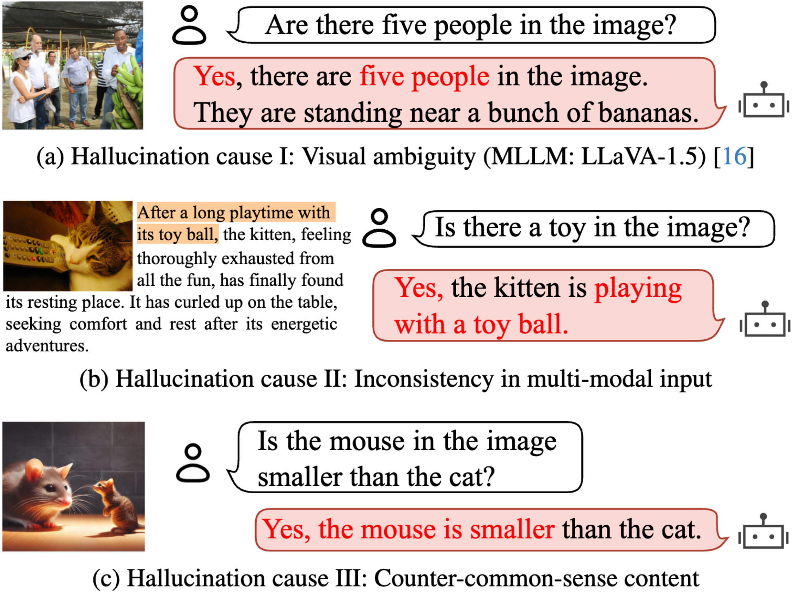
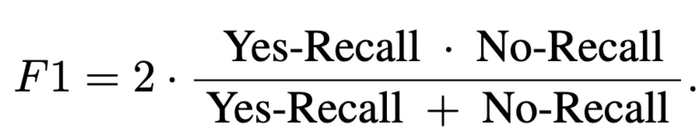

# PhD: A ChatGPT-*P*rompted Visual *h*allucination Evaluation *D*ataset

[//]: # (<div align="center">)

[//]: # ()
[//]: # (  Jiazhen Liu<sup>1,2</sup>, Yuhan Fu<sup>1,2</sup>, Ruobing Xie<sup>2</sup>, Runquan Xie<sup>2</sup>, )

[//]: # ()
[//]: # (</div>)

[//]: # ()
[//]: # (<div align="center">)

[//]: # ()
[//]: # (  Xingwu Sun<sup>2</sup>, Fengzong Lian<sup>2</sup>, Zhanhui Kang<sup>1</sup> and Xirong Li<sup>1</sup>)

[//]: # ()
[//]: # (</div>)

[//]: # ()
[//]: # (<div align="center">)

[//]: # ()
[//]: # (<sup>1</sup>Key Lab of DEKE, Renmin University of China    <sup>2</sup>Machine Learning Platform Department, Tencent)

[//]: # ()
[//]: # (</div>)

<p align="center" style="margin: 20px 0;">
  <!-- Arxiv 按钮 -->
  <a href="https://arxiv.org/abs/2403.11116" style="text-decoration: none;">
     
  </a>
<!--   <span style="vertical-align: middle; text-decoration: none;">·</span>
  <a href="https://huggingface.co/datasets/AIMClab-RUC/PhD" 
     style="text-decoration: none;">
    
  </a> -->
</p>


## News
+ Our work has been accepted at CVPR 2025! 🎉 
+ Great news! Our dataset is now available on [Hugging Face](https://huggingface.co/datasets/AIMClab-RUC/PhD). Dive in and explore its potential for your research and projects.

## Introduction

Multimodal Large Language Models (MLLMs) hallucinate, resulting in an emerging topic of visual hallucination evaluation (VHE). This paper contributes a ChatGPT-Prompted visual hallucination evaluation Dataset (PhD) for objective VHE at a large scale. The essence of VHE is to ask an MLLM questions about specific images to assess its susceptibility to hallucination. Depending on what to ask (objects, attributes, sentiment, etc.) and how the questions are asked, we structure PhD along two dimensions, i.e., task and mode. Five visual recognition tasks, ranging from low-level (object / attribute recognition) to middle-level (sentiment / position recognition and counting), are considered. Besides a normal visual QA mode, which we term PhD-base, PhD also asks questions with inaccurate context (PhD-iac) or with incorrect context (PhD-icc), or with AI-generated counter common sense images (PhD-ccs). We construct PhD by a ChatGPT-assisted semi-automated pipeline, encompassing four pivotal modules: task-specific hallucinatory item (hitem) selection, hitem-embedded question generation, inaccurate / incorrect context generation, and counter-common-sense (CCS) image generation. With over 14k daily images, 750 CCS images and 102k VQA triplets in total, PhD reveals considerable variability in MLLMs' performance across various modes and tasks, offering valuable insights into the nature of hallucination. As such, PhD stands as a potent tool not only for VHE but may also play a significant role in the refinement of MLLMs.
### Mode and Task

In particular, we consider **4** testing mode, including **5** visual tasks: object recognition, attribute recognition, sentiment understanding, positional reasoning, and counting.

Note, the different modes are specifically designed to different source of hallucinations, including **visual ambiguity** (PhD-base), **multi-modal input** (PhD-iac and PhD-icc), and **counter common sense** (PhD-ccs). See the following figure for more details.
<div align="center" >
   
</div>

### The meaning of `hitem`
**H**alluc**i**na**t**ory it**em**s (hitems) refer to specific terms (words or phrases) in visual questions posed to a MLLM that lead to discrepancies between the MLLM’s response and the corresponding visual content.

To illustrate, consider an image of a `dining table` setting that lacks a `fork`. Although the `fork` is absent, its association with the `dining table` makes it a potential hitem.

The **PhD** dataset provides hitem information for each query. For VHE-ccs, we also include the `ccs_description` to elucidate why the image may easily induce hallucinations.

Therefore, you will understand why the PhD questions are applicable to reflecting hallucinations. This is an aspect currently missing from other hallucination datasets.


### Showcases
 
The statistics of the dataset and some examples are shown below. Images of VHE-base, VHE-iac, and VHE-icc are sourced from the COCO dataset. This ensures that MLLMs have been exposed to these images. Despite this, they can still generate incorrect answers, which reflects hallucinations in low-level visual tasks.
<div align="center" > 
   
</div>

<div align="center" >
   
</div>

+ **PhD-base**: Shown in (c) with red and green block. Basically you can regard it as a normal visual question answering task (normal question and image ). But we additionally indicate the hallucinatory element (`hitem`) in the question (see data.json).
+ **PhD-iac**: Shown in (c) with yellow block. For each question in PhD-base, we further combine it with inaccurate context. This inaccurate context has some noise information unrelated to the image.
+ **PhD-icc**: Shown in (c) with purple block. Similar to PhD-iac, the question is combined with incorrect context. This context is totally conflicted with the image.
+ **PhD-ccs**: Shown in (d). Though the question is normal, the image is generated by AI and is counter-common-sense in the real world.


PhD is a consistently developing dataset, and we will continue to update and refine it. If you have any questions or suggestions, please feel free to contact us.


## Image Download

+ PhD-base, PhD-iac, and PhD-icc use COCO 2014 images (including both train and val). You can directly download the images from the [COCO website](https://cocodataset.org/#download).

+ PhD-ccs uses our AI-generated images. You can download it into `CCS_images` from the following links: [Google Drive](https://drive.google.com/file/d/1qYW6TfW-C8qz_9gXOpw2BwE-2DyN9NP-/view?usp=drive_link).


## File Organization

For your convenience in evaluation, please organize the data in the following format.

```
images/
    train2014/   
       COCO_train2014_000000000139.jpg
       COCO_train2014_000000000164.jpg
       ...
    val2014/   
       COCO_val2014_000000000139.jpg
       COCO_val2014_000000000164.jpg
       ...      
    CCS_images/
        0.png
        1.png
        ...

data.json
```

### Files for 4 modes

``` python
# this file contains data of PhD-base, PhD-iac, PhD-icc and PhD-ccs.
# the file can be read as a dict. array in JSON format. 
data = json.load(open('data.json', encoding='utf-8'))
```

### The format of `PhD-base`, `PhD-iac`, and `PhD-icc`

``` python
# Each sample includes the following keys:

"""
· image_id: indicate COCO_image id to the test image.
· task: one of the 5 tasks
· yes_question: question which answer is yes.
· no_question: question which answer is no.
· hitem: hallucination item.
· gt: ground truth.
· subject: questioned subject.
· context: {"iac": inaccurate context, "icc": incorrect context}
"""
```

+ If you want to perform **PhD-base** mode, you can just use the `question` (yes_ / no_).
+ For **PhD-iac** and **PhD-icc**, you can use the `context` to get the inaccurate or incorrect context, and then combine it with the `question`.
  + For example: `context["iac"]` + `" In case there is an inconsistency between the context and the image content, you should follow the image. "` + `question`.

### The format of `PhD-ccs`
   
``` python
"""
· image_id: indicate id of our generated images.
· ccs_description: specific the reason why the image is counter-common-sense.
· yes_question: question which answer is yes.
· no_question: question which answer is no.
· task: one of the 5 tasks.
"""
```

## Demo Code for Loading
    
``` python
import json
import os

def get_data(data=None):
    if data is None:
        data = json.load(open('data.json', encoding='utf-8'))

    # Examples: Loading PhD-base, PhD-iac, PhD-icc, and PhD-ccs
    # PhD-base
    phd_base = []
    for sample in data:
        if 'ccs_description' in sample:
            continue
        coco_image_name = f"{sample['image_id'].zfill(12)}"
        image_path = f"images/train2014/COCO_train2014_{coco_image_name}.jpg"
        if not os.path.exists(image_path):
            image_path = f"images/val2014/COCO_val2014_{coco_image_name}.jpg"
        phd_base.append({'image_id': sample['image_id'], 'yes_question': sample['yes_question'], 'image_path': image_path, 'task': sample['task'],
                            'no_question': sample['no_question']})


    # PhD-iac
    instruction = " In case there is an inconsistency between the context and the image content, you should follow the image. "
    phd_iac = []
    for sample in data:
        if 'ccs_description' in sample:
            continue
        yes_question = sample["context"]["iac"] + instruction + sample['yes_question']
        no_question = sample["context"]["iac"] + instruction + sample['no_question']
        coco_image_name = f"{sample['image_id'].zfill(12)}"
        image_path = f"images/train2014/COCO_train2014_{coco_image_name}.jpg"
        if not os.path.exists(image_path):
            image_path = f"images/val2014/COCO_val2014_{coco_image_name}.jpg"
        phd_iac.append({'image_id': sample['image_id'], 'yes_question': yes_question, 'image_path': image_path, 'task': sample['task'],
                        'no_question': no_question})

    # PhD-icc
    instruction = " In case there is an inconsistency between the context and the image content, you should follow the image. "
    phd_icc = []
    for sample in data:
        if 'ccs_description' in sample:
            continue
        yes_question = sample["context"]["icc"] + instruction + sample['yes_question']
        no_question = sample["context"]["icc"] + instruction + sample['no_question']
        coco_image_name = f"{sample['image_id'].zfill(12)}"
        image_path = f"images/train2014/COCO_train2014_{coco_image_name}.jpg"
        if not os.path.exists(image_path):
            image_path = f"images/val2014/COCO_val2014_{coco_image_name}.jpg"
        phd_icc.append({'image_id': sample['image_id'], 'yes_question': yes_question, 'image_path': image_path, 'task': sample['task'],
                        'no_question': no_question})

    # PhD-ccs
    phd_ccs = [{'image_id': sample['image_id'], 'yes_question': sample['yes_question'], 'image_path': os.path.join('images/CCS_images', f"{sample['image_id']}.png"), 'task': sample['task'],
                'no_question': sample['no_question']} for sample in data if 'ccs_description' in sample]

    return phd_base, phd_iac, phd_icc, phd_ccs
```

## Metric

As mentioned in papers, we propose a novel evaluation metric, the PhD score, to evaluate the performance of MLLMs on the PhD dataset.
Simply to say, the **PhD Index** is the F1 value of the recall rates for `yes` and `no` answers, 
which is designed to be sensitive to the tendency of outputing `yes` or `no`, providing a nuanced understanding of the model's performance.

<div align="center">
   
</div>

For the evaluation results, please refer to the `experiment` section of the paper, as well as the supplementary materials.

## Citation

If you found this work useful, consider giving this repository a star and citing our paper as followed:

```
@misc{liu2024phd,
      title={PhD: A Prompted Visual Hallucination Evaluation Dataset}, 
      author={Jiazhen Liu and Yuhan Fu and Ruobing Xie and Runquan Xie and Xingwu Sun and Fengzong Lian and Zhanhui Kang and Xirong Li},
      year={2024},
      eprint={2403.11116},
      archivePrefix={arXiv},
      primaryClass={cs.CV}
}
```
