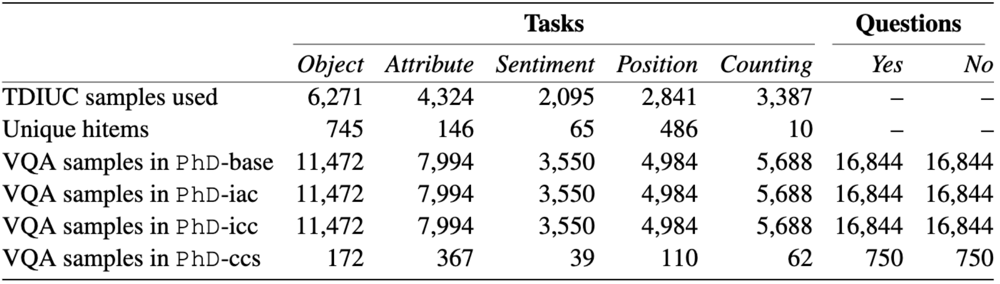

# PhD: A Prompted Visual Hallucination Evaluation Dataset

[//]: # (<div align="center">)

[//]: # (  Jiazhen Liu<sup>1,2</sup>, Yuhan Fu<sup>1,2</sup>, Ruobing Xie<sup>2</sup>, Runquan Xie<sup>2</sup>, )

[//]: # (</div>)

[//]: # (<div align="center">)

[//]: # (  Xingwu Sun<sup>2</sup>, Fengzong Lian<sup>2</sup>, Zhanhui Kang<sup>1</sup> and Xirong Li<sup>1</sup>)

[//]: # (</div>)

[//]: # (<div align="center">)

[//]: # (<sup>1</sup>Key Lab of DEKE, Renmin University of China    <sup>2</sup>Machine Learning Platform Department, Tencent)

[//]: # (</div>)

[//]: # (<div align="center">)

[//]: # (    <a href="https://arxiv.org/abs/2403.11116"></a>)

[//]: # (</div>)

[//]: # ()
[//]: # (**Note: Due to certain policy restrictions, the version of the paper on arXiv is not the final version, whereas the data in this repository is the latest version. When using PhD dataset, it's advisable to refer to the instructions provided within. If you have any questions or concerns, feel free to raise an issue for discussion.**)

## Introduction

Multimodal Large Language Models (MLLMs) hallucinate, resulting in an emerging topic of visual hallucination evaluation (VHE). We introduce in this paper PhD, a large-scale benchmark for VHE. The essence of VHE is to ask an MLLM the right questions concerning a specific image. Depending on what to ask (objects, attributes, sentiment, etc.) and how the questions are asked, we structure PhD along two dimensions, i.e. task and mode. Five visual recognition tasks, ranging from low-level (object / attribute recognition) to middle-level (sentiment / position recognition and counting), are considered. Besides a normal visual QA mode, which we term VHE-base, PhD also asks questions with inaccurate context (VHE-iac) or with incorrect context (VHE-icc), or with AI-generated counter common sense images (VHE-ccs). We construct PhD by a ChatGPT-assisted semi-automated pipeline, encompassing four pivotal modules: task-specific hallucinatory element (hitem) selection, hitem-embedded question generation, inaccurate / incorrect context generation, and CCS image generation. With over 102k VQA triplets in total, PhD reveals considerable variability in MLLMs' performance across various modes, offering valuable insights into the nature of hallucination issues. As such, PhD stands as a potent tool not only for VHE but may also play a significant role in the refinement of MLLMs.
### Mode and Task

In particular, we consider **4** testing mode, including **5** visual tasks: object recognition, attribute recognition, sentiment understanding, positional reasoning, and counting.

Note, the different modes are specifically designed to different source of hallucinations, including weak visual features (VHE-base), modality imbalance (VHE-iac and VHE-icc), and counter common sense (VHE-ccs).

### Showcases
 
The statistics of the dataset and some examples are shown below. Images of VHE-base, VHE-iac, and VHE-icc are sourced from the COCO dataset. This ensures that MLLMs have been exposed to these images. Despite this, they can still generate incorrect answers, which reflects hallucinations in low-level visual tasks.
<div align="center" > 
   
</div>

<div align="center" >
   
</div>

+ **VHE-base**: Shown in (c) with red and green block. Basically you can regard it as a normal visual question answering task (normal question and image ). But we additionally indicate the hallucinatory element (`hitem`) in the question (see data.json).
+ **VHE-iac**: Shown in (c) with yellow block. For each question in VHE-base, we further combine it with inaccurate context. This inaccurate context has some noise information unrelated to the image.
+ **VHE-icc**: Shown in (c) with purple block. Similar to VHE-iac, the question is combined with incorrect context. This context is totally conflicted with the image.
+ **VHE-ccs**: Shown in (d). Though the question is normal, the image is generated by AI and is counter-common-sense in the real world.


PhD is a consistently developing dataset, and we will continue to update and refine it. If you have any questions or suggestions, please feel free to contact us.


## Image Download

+ VHE-base, VHE-iac, and VHE-icc use COCO 2014 images (including both train and val). You can directly download the images from the [COCO website](https://cocodataset.org/#download).

+ VHE-ccs uses our AI-generated images. You can download it into `CCS_images` from the following links: [Google Drive](https://drive.google.com/file/d/1Ex7kRqIsG2oYdl4BPIC392pxuwnwML1m/view?usp=drive_link) or [Baidu Drive](https://pan.baidu.com/s/1dnZJDOAc3q419p-VwIViFw?pwd=a7xi).


## Data Organization

### Directory

For your convenience in evaluation, please organize the data in the following format.

```
images/
    COCO/
        train2014/   
           COCO_train2014_000000000139.jpg
           COCO_train2014_000000000164.jpg
           ...
        val2014/   
           COCO_val2014_000000000139.jpg
           COCO_val2014_000000000164.jpg
           ...      
    CCS_images/
        0.png
        1.png
        ...
        750.png
data_base.json
data_ccs.json
```

### The format of `data_base.jsonl`

``` python
# Each line is one evaluation sample and can be read as a dict. in JSON format. 
# It includes the following keys:

"""
· image_path: indicate the path to the test image.
· item: hitem / gd, specify the hallucination element / ground truth.
· object: specify which specific object in the question is associated with the hitem / gd.
· question: ...
· answer: ...
· task: one of the 5 tasks
· context: {"iac": inaccurate context, "icc": incorrect context}
"""

# For example
{"image_path": ..., "hitem": "red", "item": "dresser", "answer": "No", 
"question": "Is the dresser red in the image?", "task": "attribute", 
"context": {"iac": ..., "icc": ...}}
```

+ If you want to perform VHE-base mode, you can just use the `question` and `answer`.
+ For VHE-iac and VHE-icc, you can use the `context` to get the inaccurate or incorrect context, and then combine it with the `question` to get the final question.
  + For example: `question` + `" In case there is an inconsistency between the context and the image content, you should follow the image. "` + `context["iac"]`.

### The format of `data_ccs.jsonl`
   
``` python
# Each line is one evaluation sample and can be read as a dict. in JSON format.
# It includes the following keys:
"""
· image_path: indicate the path to the test image.
· ccs description: specific the reason why the image is counter-common-sense.
· question: ...
· answer: ...
"""
```
Note, since the task of CCS data is hard to identify, 
For instance, the question `Is the electric pole standing straight beside the road?` is associated with attribute and position tasks. So we don't recommond to simply categorize them into one single task.
## Metric

As mentioned in papers, we propose a novel evaluation metric, the PhD score, to evaluate the performance of MLLMs on the PhD dataset.
Simply to say, the PhD score is the F1 value of the recall rates for `yes` and `no` answers, 
which is designed to be sensitive to the tendency of outputing `yes` or `no`, providing a nuanced understanding of the model's performance.

<div align="center">
   
</div>

For the evaluation results, please refer to the `experiment` session of the paper, as well as the supplementary materials.

## Citation

If you found this work useful, consider giving this repository a star and citing our paper as followed:

```
@misc{liu2024phd,
      title={PhD: A Prompted Visual Hallucination Evaluation Dataset}, 
      author={Jiazhen Liu and Yuhan Fu and Ruobing Xie and Runquan Xie and Xingwu Sun and Fengzong Lian and Zhanhui Kang and Xirong Li},
      year={2024},
      eprint={2403.11116},
      archivePrefix={arXiv},
      primaryClass={cs.CV}
}
```
